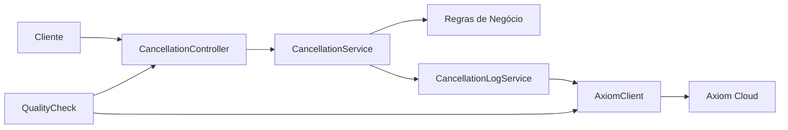

# 🚀 Serviço de Cancelamento com Integração Axiom


Um serviço robusto para gerenciar cancelamentos de pedidos com integração para logging em nuvem com [Axiom](https://axiom.co/), proporcionando rastreabilidade, monitoramento e análise de dados em tempo real.

## 🔍 Sobre o Projeto

Este sistema implementa uma API de cancelamento de pedidos com regras de negócio específicas, como a impossibilidade de cancelar pedidos com valor acima de R$ 1.000,00 e a aplicação de uma taxa de 10% para cancelamentos.

A principal característica do sistema é a **integração com Axiom** para logging em nuvem, permitindo:

- Rastreamento de todas as tentativas de cancelamento (bem-sucedidas e falhas)
- Monitoramento em tempo real da saúde da integração
- Análise de dados e estatísticas de cancelamentos
- Sistema de qualidade e verificação periódica

## 📊 Demonstração


*A imagem acima mostra a integração do serviço de cancelamento com o dashboard Axiom, onde é possível visualizar logs, métricas e estatísticas dos cancelamentos em tempo real.*

## 🔄 Estrutura de Integração

A arquitetura de integração com Axiom segue o padrão Clean Architecture, organizando o sistema em camadas bem definidas:

### Camadas

- **Apresentação**: Controladores Fastify que expõem a API REST
- **Negócio**: Serviço de Cancelamento que implementa as regras de negócio
- **Integração**: Cliente e Serviços Axiom para logging e consulta
- **Monitoramento**: Health Checks e Verificação de Qualidade

### Componentes

- **CancellationController**: Recebe requisições HTTP e orquestra o fluxo
- **CancellationService**: Implementa regras de cancelamento + logging
- **AxiomClient**: Cliente para comunicação com a API Axiom
- **CancellationLogService**: Serviço para logging e consulta de dados
- **AxiomHealthCheck**: Monitoramento da saúde da integração
- **QualityCheck**: Sistema periódico de verificação de qualidade

### Fluxos



## 🛠 Tecnologias

- **TypeScript**: Linguagem principal
- **Fastify**: Framework web para criação da API
- **Node.js**: Ambiente de execução
- **Axiom API**: Para logging e análise de dados
- **Swagger/OpenAPI**: Documentação da API
- **Scalar API Reference**: Interface interativa da documentação
- **Dotenv**: Gerenciamento de variáveis de ambiente
- **Axios**: Cliente HTTP para integração e testes

## 📋 Requisitos

- Node.js >= 16.0.0
- NPM >= 8.0.0
- Conta no [Axiom](https://app.axiom.co/) com um Dataset criado
- Token de API do Axiom com permissões de escrita/leitura

## ⚙️ Configuração

1. Clone o repositório:
   ```bash
   git clone https://github.com/seu-usuario/axiom_integration.git
   cd axiom_integration
   ```

2. Instale as dependências:
   ```bash
   npm install
   ```

3. Crie um arquivo `.env` na raiz do projeto:
   ```env
   # Configurações do servidor
   PORT=3000
   HOST=0.0.0.0
   NODE_ENV=development
   LOG_LEVEL=info

   # Configurações Axiom
   AXIOM_API_TOKEN=seu-token-aqui
   AXIOM_DATASET_NAME=cancellation-logs
   AXIOM_REGION=us
   AXIOM_TIMEOUT=5000
   AXIOM_HEALTH_CHECK_INTERVAL=300000

   # Configurações de Qualidade
   QUALITY_CHECK_INTERVAL=3600000
   API_BASE_URL=http://localhost:3000
   ```

## 🚀 Executando o Projeto

### Modo de Desenvolvimento

```bash
# Iniciar servidor em modo de desenvolvimento
npm run dev

# Iniciar servidor com integração Axiom ativada
npm run dev:logging
```

### Modo de Produção

```bash
# Compilar o projeto
npm run build

# Iniciar servidor em produção
npm start

# Iniciar servidor com integração Axiom ativada
npm run start:logging
```

### Verificação de Qualidade

```bash
# Executar verificação de qualidade manualmente
npm run quality-check
```

## 📡 Endpoints da API

### Operações de Cancelamento

- **POST /cancel**
  - Cancela um pedido com base nas regras de negócio
  - Body: `{ "id": "string", "totalAmount": number, "status": "string" }`

- **GET /can-cancel/:id/:totalAmount**
  - Verifica se um pedido pode ser cancelado

### Monitoramento

- **GET /health/axiom**
  - Verifica o status da integração com Axiom

### Estatísticas e Logs

- **GET /stats/cancellations**
  - Obtém estatísticas sobre cancelamentos
  - Query params: `startDate`, `endDate`

- **GET /logs/cancellations/successful**
  - Obtém logs de cancelamentos bem-sucedidos
  - Query params: `startDate`, `endDate`, `limit`

- **GET /logs/cancellations/failed**
  - Obtém logs de cancelamentos falhos
  - Query params: `startDate`, `endDate`, `limit`

## 🧪 Controle de Qualidade

O sistema inclui um módulo de verificação periódica da qualidade da integração com Axiom, que realiza as seguintes verificações:

1. **Monitoramento de Saúde**: Verifica se a integração com Axiom está operacional
2. **Teste de Fluxo de Sucesso**: Testa um cancelamento bem-sucedido e verifica o log
3. **Teste de Fluxo de Falha**: Testa um cancelamento inválido e verifica o log
4. **Verificação de Consistência**: Analisa a estrutura e qualidade dos dados no Axiom
5. **Análise de Estatísticas**: Verifica se as estatísticas são consistentes

O sistema também inclui monitoramento em tempo real com notificações de eventos e tratamento de exceções.

## 📚 Documentação

A API é documentada usando OpenAPI/Swagger e inclui uma interface interativa API Reference.

- **Documentação da API**: Disponível em `/docs` (em execução)
- **API Reference**: Disponível em `/reference` (em execução)

---

## 📄 Licença

Este projeto está licenciado sob a Licença MIT - veja o arquivo [LICENSE](LICENSE) para detalhes.

---

Desenvolvido por [Victor Gabriel Marques](https://github.com/victorgabrielmarques)
